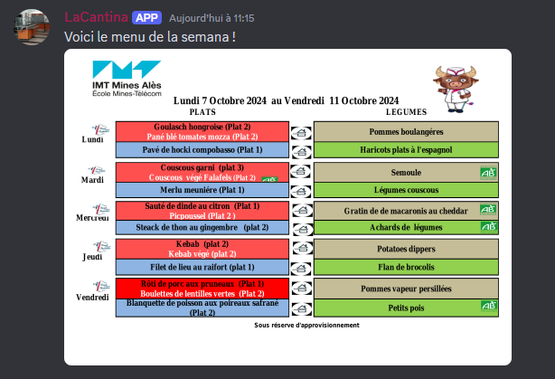

# LaCantina

**LaCantina** est un bot Discord qui permet d'envoyer automatiquement le menu de la cantine des Mines d'Alès dans un ou plusieurs channels Discord dès qu'il est mis à jour par le personnel.

## Fonctionnalités
- Vérification automatique du menu de la cantine sur le site web.
- Envoi du menu sous forme d'image (première page du PDF) dans les channels Discord spécifiés.
- Commande `!menu` pour afficher manuellement le menu à tout moment.

### Exemple d'affichage du menu :



## Prérequis

Avant de commencer, assure-toi d'avoir installé les outils suivants :
- [Docker](https://docs.docker.com/get-docker/)
- [Docker Compose](https://docs.docker.com/compose/install/)
- Un bot Discord avec son **token** (voir section [Configuration du Bot](#configuration-du-bot-discord)).

## Configuration du Bot Discord

1. Crée un bot Discord :
   - Va sur [Discord Developer Portal](https://discord.com/developers/applications) et crée une nouvelle application.
   - Dans l'onglet **Bot**, ajoute un bot à l'application.
   - Copie le **token** du bot pour l'utiliser plus tard dans la configuration.

2. Ajoute le bot à ton serveur Discord :
   - Va dans l'onglet **OAuth2** > **URL Generator**.
   - Coche les scopes **bot** et les permissions comme **Send Messages**, **Attach Files**, etc.
   - Génére l'URL et invite ton bot à rejoindre ton serveur.

3. Récupère les **ID des channels Discord** :
   - Active le mode développeur dans Discord (Paramètres utilisateur > Avancé > Mode développeur).
   - Clique droit sur le channel où tu veux que le bot envoie le menu, puis sélectionne **Copier l'ID**.

## Installation

### Étape 1 : Clone le dépôt

```bash
git clone https://github.com/ton-repo/LaCantina.git
cd LaCantina
```

### Étape 2 : Configuration du fichier .env

Crée un fichier .env dans le répertoire racine de ton projet avec le contenu suivant :

```bash
DISCORD_TOKEN=ton_token_discord
CHANNEL_ID_1=ton_id_channel_1
CHANNEL_ID_2=ton_id_channel_2
``` 

Remplace :

Ton_token_discord par le token de ton bot Discord.

PS: tu peux mettre plusieurs channel id

### Étape 3 : Docker Compose

Un fichier docker-compose.yml est inclus dans le projet pour faciliter l'exécution avec Docker.
Fichier docker-compose.yml :

```yaml
version: '3'
services:
  bot-lacantina:
    build: .
    container_name: bot-lacantina
    restart: always
    env_file:
      - .env
    volumes:
      - .:/app
    command: python LaCantina.py
```
Ce fichier fait tourner le bot automatiquement avec Docker.

### Étape 4 : Lancer le bot avec Docker Compose

Dans le répertoire du projet, exécute la commande suivante :

```bash
docker-compose up -d
``` 

Le bot démarre et envoie automatiquement le menu dans les channels Discord spécifiés lorsque le fichier est mis à jour.

### Étape 5 : Utilisation manuelle

Tu peux utiliser la commande ***!menu*** dans Discord pour afficher manuellement le menu :

```bash
!menu
 ```
Le bot téléchargera et enverra la version actuelle du menu dans le channel.


## Fonctionnement

Le bot vérifie périodiquement (toutes les heures) le fichier PDF du menu de la cantine sur le site web des Mines d'Alès. S'il détecte une mise à jour (changement de la date de modification), il télécharge le nouveau menu, convertit la première page en image, et l'envoie automatiquement dans les channels Discord spécifiés.
Contribuer

Les contributions sont les bienvenues ! Ouvre une issue ou un pull request si tu souhaites améliorer LaCantina.

## Auteur

Développé par LukuLaMule.


